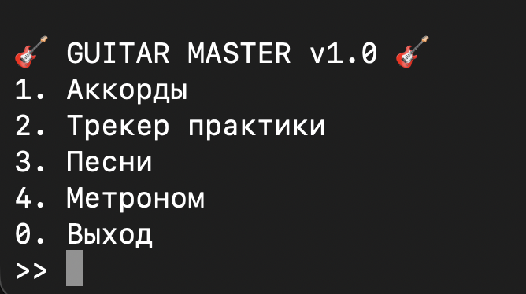
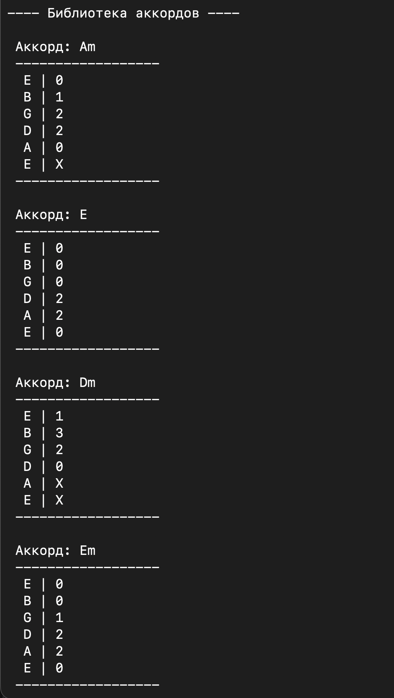
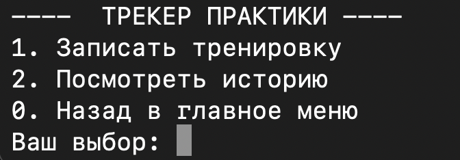
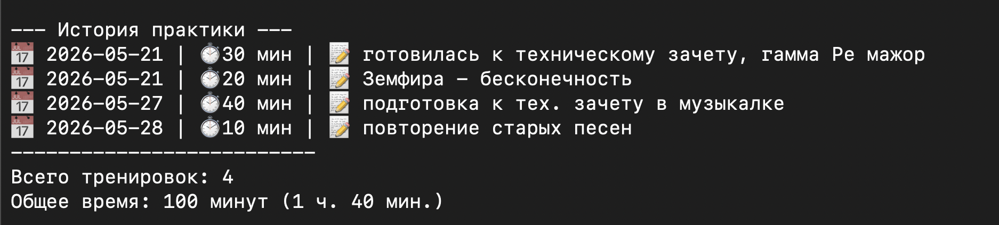
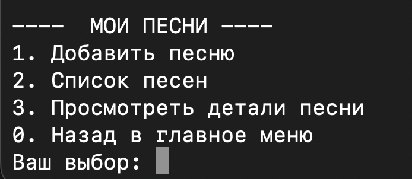
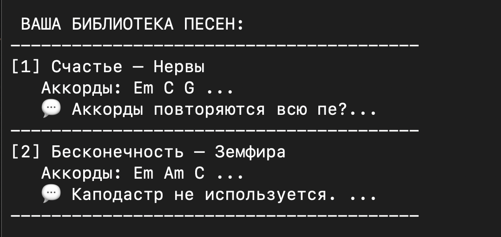
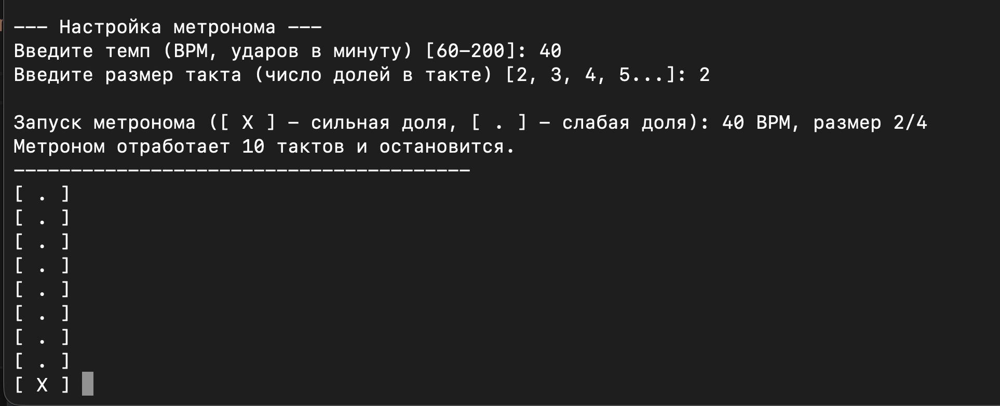
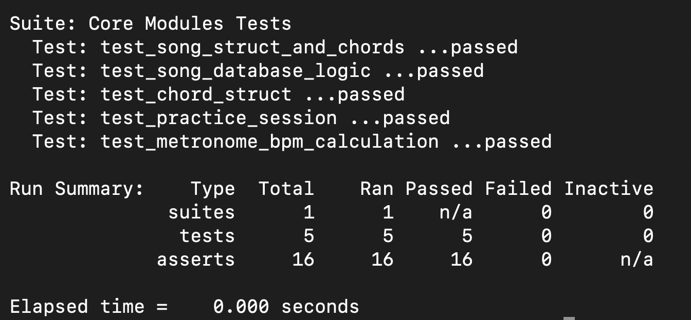

# 🎸 Guitar Master

**Console-based Guitar Assistant Application**

A comprehensive tool for guitarists developed in C++. Manage your chord library, track practice sessions, save favorite songs with lyrics and chords, and use a visual metronome for timing practice.

---

## 📋 Project Description

Guitar Master is a console application designed to help musicians organize their practice routine and musical knowledge. The application features:

- **Chord Library**: Create, view, and manage guitar chords with fret positions
- **Practice Tracker**: Log your practice sessions with date, duration, and notes. Track your progress over time
- **Song Manager**: Save complete songs with titles, authors, chord progressions, and personal comments (capo position, strumming patterns, etc.)
- **Visual Metronome**: Console-based metronome with customizable tempo (BPM) and time signatures for rhythm training

All data is persisted in text files, ensuring your information is saved between sessions.

---

## 📸 Screenshots

















---

## 🛠️ Technology Stack

| Category | Technology |
| :--- | :--- |
| **Language** | C++ |
| **Build System** | Make (Makefile) |
| **Testing Framework** | CUnit |
| **Data Storage** | Plain text files (`.txt`) |
| **Platform** | Cross-platform (macOS, Linux, Windows) |
| **Version Control** | Git, GitHub |

**External Dependencies:**
- CUnit testing framework (`libcunit1-dev` on Linux, `cunit` via Homebrew on macOS)

---

## 📥 Installation & Setup

### Step 1: Clone the Repository

```bash
git clone https://github.com/vicktoru594-code/guitar-assistant.git
cd guitar-assistant
```

### Step 2: Install Dependencies

**For macOS:**
```bash
brew install cunit
```

**For Linux (Ubuntu/Debian):**
```bash
sudo apt-get update
sudo apt-get install libcunit1-dev
```

### Step 3: Build the Project
```bash
make
```

### Step 4: Run the Application
```bash
./build/guitar_app
```
---

## 🧪 Testing

The project includes unit tests for all core modules.

### Run Tests
```bash
make test
```


---

## 📊 Project Status
 
### Status: ✅ Completed

### Features Implemented:
- ✅ Chord management with file persistence
- ✅ Practice session tracking
- ✅ Song library with detailed information
- ✅ Visual metronome with animated beat indicator
- ✅ Unit tests for all modules
- ✅ Makefile build system
- ✅ Comprehensive documentation

## 👤 Author
### Kurochkina Victoria
Student at SibGUTI